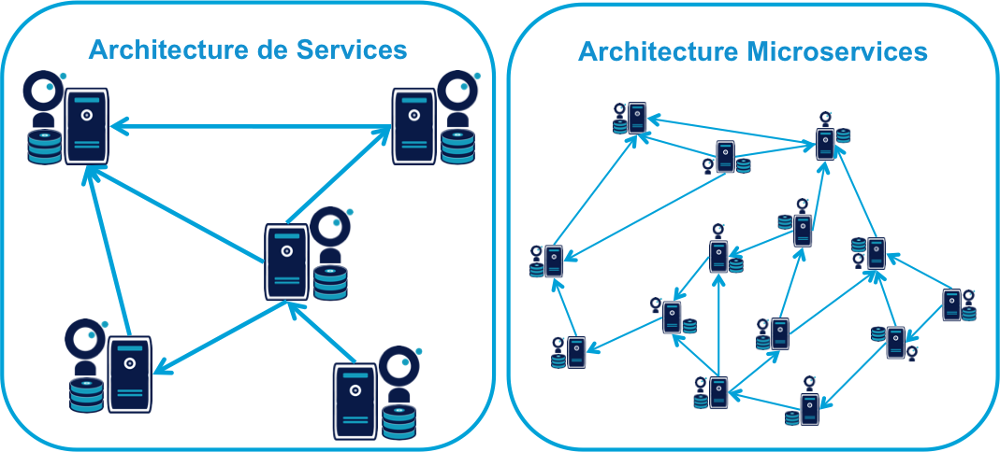
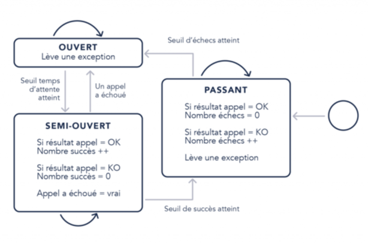

@title[Introduction]
## @color[#cc6699](Microservices / Hystrix)
---
### Les Microservices : Définition
@size[0.7em](L’architecture en microservices est une approche servant à concevoir une application unique basé sur un ensemble de petits services* indépendants. Chaque microservice s’exécute dans un processus qui)
@size[0.7em]( lui est propre et communique via un protocole léger, le plus souvent à base de ressource HTTP  tel que REST par exemple)
 
 
@size[0.5em]( * service: une unité fonctionnelle représentée par plusieurs services techniques. )

+++
### Les Microservices : Pourquoi?
* @size[0.7em](Complexité du code :) 
  * @size[0.5em](Évolutivité et fiabilité : Difficile d’ajouter proprement des nouvelles fonctionnalités et d’effectuer des refactorings.)
  * @size[0.5em](Scalabilité horizontale : Pas de séparation entre service stateless / stateful. On doit gérer le  sharding / steaky session.)

* @size[0.7em](Innovation :)
  * @size[0.5em](Technologique : Difficile d’introduire de nouveaux outils/ langages pour des besoins spécifiques.)
  * @size[0.5em](Métier : Pas de séparation entre les composants critiques et ceux moins critiques qui peuvent être sujet d'innovation métier.) 

+++
   

@size[0.5em](Le découpage se fait par domaine métier, en groupant les services et les types de données qui ont des liens forts, et en séparant quand ils sont suffisamment indépendants.)  
+++

### Les Microservices : Problèmes?
Illusions de l’informatique distribuée :

 - @size[0.7em](Le réseau est fiable.)
 - @size[0.7em](Le temps de latence est nul.)
 - @size[0.7em](La bande passante est infinie.)
 - @size[0.7em](Le réseau est sûr.)
 - @size[0.7em](La topologie du réseau ne change pas.)
 - @size[0.7em](Il y a un et un seul administrateur réseau.)
 - @size[0.7em](Le coût de transport est nul.)
 - @size[0.7em](Le réseau est homogène.)

+++
La réalité: 
   -  @size[0.7em](Lorsque les ressources sont conservées plus longtemps que nécessaire, elles peuvent être épuisées et les systèmes peuvent cesser de répondre. Les ressources incluent les threads, les connexions réseau, la mémoire, etc.)
   -  @size[0.7em](Lorsque l'utilisation des ressources n'est pas contrôlée / limitée, les systèmes  peuvent ralentir et devenir inactifs)
   -  @size[0.7em](Lorsque l'utilisation des ressources n'est pas contrôlée / limitée, les erreurs des systèmes peuvent se propager, provoquant des erreurs en cascade sur tous les systèmes)
+++
### Exemple: 
Un système composé de 30 services environs: 

  - @size[0.7em](99.99^30 = 99.7% disponibilité)
  - @size[0.7em](0.3% d'un  milliard de requêtes = 3,000,000 requêtes en erreur.)
  - @size[0.7em](2+ heures temps d'arrêt / mois même si toutes les dépendances possèdent une excellente disponibilité).
  
@size[0.5em](* Tout celà reste théorique en réalité la situation est plus grave)

---
### Hystrix: Définition

@size[0.7em](Hystrix est une bibliothèque de latence et de tolérance aux pannes conçue pour isoler les points d'accès aux systèmes et services tiers distants,)
@size[0.7em](prévenir la cascade des pannes et permettre la résilience dans les systèmes distribués complexes où les pannes sont inévitables.)

+++
### Hystrix: Solutions
- @size[0.7em](Timeout : Libérer les ressources du systèmes et prévenir les blocages d'appels.)
- @size[0.7em](Thread Pools / Semaphores : Limiter l'utilisatsion des ressources,  Limiter le nombre d'appels concurrents à un composant : Bulkhead pattern)
- @size[0.7em](Fallback: Implémenter une réponse alternative envoyée en cas d'indisponibilité de la ressource : Fail Fast pattern)
- @size[0.7em](Requests Collapsing:  exécuter plusieurs requêtes en batch , avec une seule connexion réseau)
- @size[0.7em](Requests Caching)
-  @size[0.7em](Circuit Breakers)
+++


@size[0.5em](Désactiver l’envoi de requêtes au service appelé et de renvoyer plus rapidement une réponse alternative de repli "fallback" aussi appelé graceful degradation,)
@size[0.5em](en fonction d’un certain nombre de critères d’erreur: timeout, nombre d’erreurs, élément dans la réponse)
+++
### Hystrix : Implémentation 
```java
    @HystrixCommand(fallbackMethod = "fallBackHello",
            commandKey = "hello", groupKey = "hello")
    @GetMapping("/hello")
    public String hello() {
        return "Hello World";
        }
    public String fallBackHello() {
            return "Fall Back Hello initiated";
    }
```
@[1-2](Annotation pour la création d'un objet HystrixCommand)
@[7-8](Méthode FallBack)
+++
@size[0.4em](Diagramme représentatif d'un appel à un service via une commande Hystrix.)  


- @size[0.5em](Diagramme de séquence : https://design.codelytics.io/hystrix/how-it-works)
+++
### Hystrix Circuit Breaker:
- @size[0.5em](https://raw.githubusercontent.com/wiki/Netflix/Hystrix/images/circuit-breaker-1280.png)
+++
### Hystrix Dashboard

+++
## Démo
@box[bg-blue text-white waved demo-box-pad](Reading: "/to-read")
@box[bg-blue text-white waved demo-box-pad](BookStore)
---
### What's Next
* @size[0.7em](Hystrix : projet en mode maintenance, mais a été intégré dans  Spring Cloud  : Spring Cloud Netflix Hystrix depuis Mars 2015.)
* @size[0.7em](concurrency-limits : détection automatique de la limite de concurrence à travers les pour réaliser une latence optimale) 
  * @size[0.5em](Algorithme TCP implémenté : Vegas + Algorithme d' Optimisation :  Gradient)
